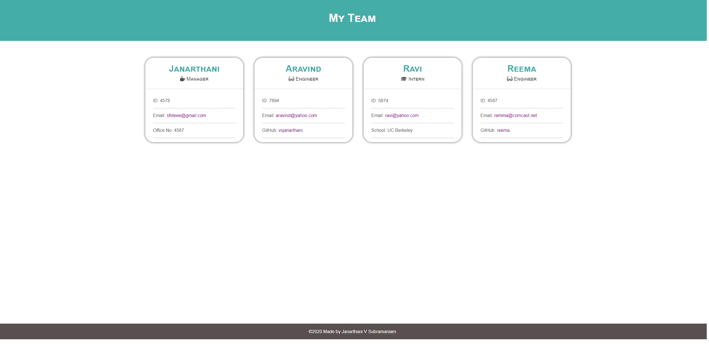

# Employee Profile Generator [](https://opensource.org/licenses/MIT)

## Description
This is an apllication for generating employee profiles for a team. The application prompts for user input such as name, email id, emp id, school, github username, role, office number etc to generate the team profile. After obtaining the user input, the application will generate a HTML file that displays the employee data styled neatly. 

## Languages
JavaScript, HTML, CSS, ES6, Node.js (inquirer and Jest).

## Table of Contents
* [Installation](#Installation)
* [Usage](#Usage)
* [License](#License)
* [Contributing](#Contributing)
* [Tests](#Tests)
* [Screenshot](#Screenshot)
* [Questions](#Questions)

### Installation
Inorder to install the necessary dependencies, run the following command in your terminal.

```npm install```

### Usage
After installing all the dependencies, run npm index in your terminal. You will be prompted for user input. Once all the information is entered, the realtive files will be generated inside "dist" folder. For a walkthrough demo click here [!Demo](https://drive.google.com/file/d/1jQFgL2msM3HRR-pW9IqJ0aA0WHYgyPLE/view).

### License
This application is covered under the following license. For more information on license's conditions, permissions and limitations please visit [here](https://choosealicense.com/licenses/) 

**MIT**

### Contributing 
No contributions at the moment. If anyone wishes to provide contributions, please contact the author.

### Tests
Inorder to test, run the following command in your terminal. Please note that this test requires jest to be installed as dev dependency.

```npm test```

### Screenshot

### Questions
If you have any questions, please reach out to the<br>
Author: Janarthani V S <br>
Email 📧: janarthani.vs@gmail.com <br>
Author's github profile: [GitHub](https://github.com/vsjanarthani)
